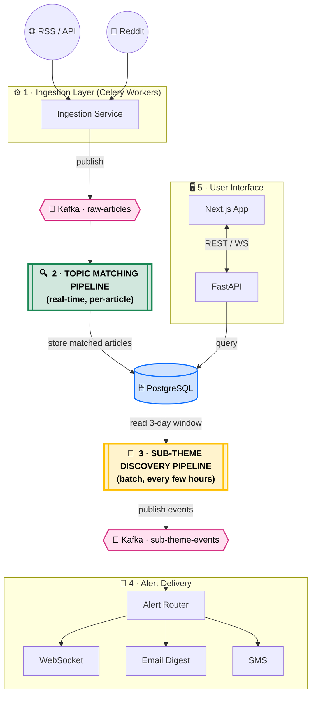
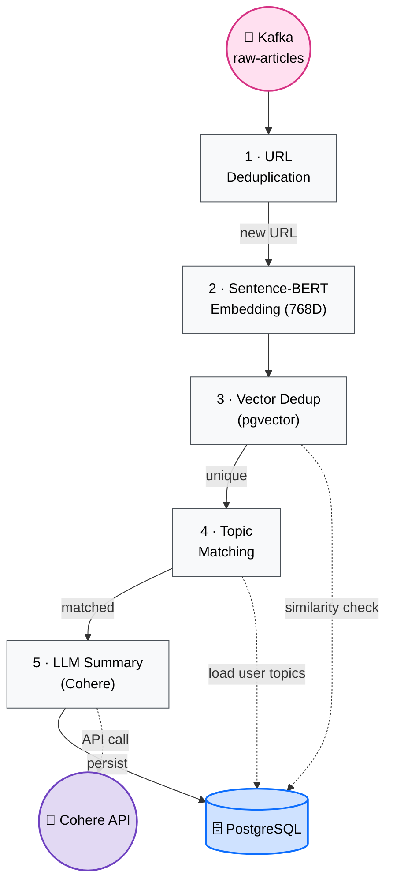
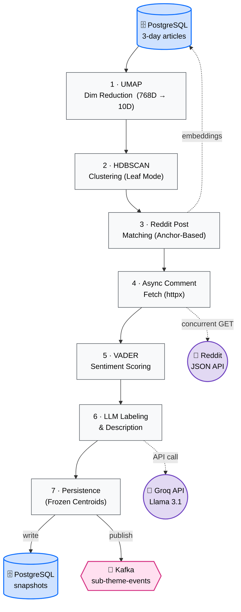

# Project Architecture & Data Flow

This document provides a clear, end-to-end visualization of how data flows through the **Real-Time Topic Tracking & Alert Intelligence** system — from raw ingestion to discovered sub-theme intelligence.

---

## 1. High-Level System Architecture

The top-level orchestration view. The two **bold-bordered** nodes are abstracted pipelines — expanded in detail in Section 2.

---

## 2. Detailed Pipeline Breakdowns

### A · Topic Matching Pipeline  *(Real-Time)*

Every incoming article passes through this pipeline **individually**. It consumes from `Kafka: raw-articles`, deduplicates, matches against user topics, generates a summary, and stores the result.

### B · Sub-theme Discovery Pipeline  *(Batch)*

Runs every few hours over a **rolling 3-day window**. Clusters articles, maps Reddit social signals, performs sentiment analysis, generates AI labels, and publishes state-change events.

---

## 3. Component Summary

| Layer | Technology | Role |
|-------|-----------|------|
| **Ingestion** | Celery Workers, PRAW | Polls RSS/API every 10 min, fetches Reddit posts |
| **Topic Matching** | Sentence-BERT, pgvector, Cohere | Dedup → Embed → Match → Summarize (real-time) |
| **Discovery** | UMAP, HDBSCAN, VADER, Groq | Cluster → Reddit Align → Sentiment → Label (batch) |
| **Kafka** | Apache Kafka | Decouples ingestion, matching, and alerting |
| **Alerting** | WebSocket, Email, SMS | Fan-out delivery of state-change events |
| **Frontend** | Next.js, FastAPI | Dashboard, topic management, intelligence views |

---

## 4. Data Flow Summary

1. **Articles** flow from **RSS / API** → **Kafka** → **Topic Matching Pipeline** → **PostgreSQL**.
2. **Social Signals** flow from **Reddit API** → **Discovery Pipeline** → **Sentiment Analysis**.
3. **Sub-themes** are formed by **Discovery** reading from **PostgreSQL** → **Kafka** → **Alert Service**.
4. **Users** view everything via **Next.js** ↔ **FastAPI** ↔ **PostgreSQL**.
