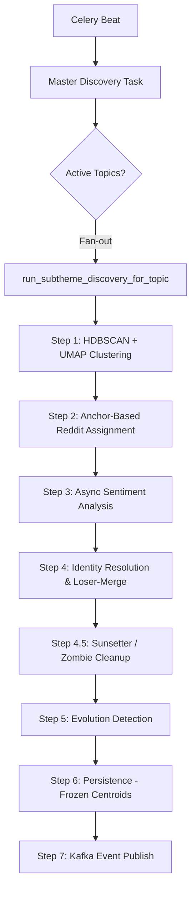

# Intelligence Layer — Low-Level Design

> **Section:** 3.8 — Sub-theme Discovery & Sentiment Analysis
> **Phase:** 3 — Low-Level Design
> **Depends on:** schema.sql, high-level-design.md, pipeline-lld.md, kafka-lld.md, celery-lld.md

---

## Table of Contents

1. [Overview](#1-overview)
2. [Data Sources](#2-data-sources)
3. [Discovery Job Orchestration](#3-discovery-job-orchestration)
4. [Step 1 — Clustering (HDBSCAN + UMAP)](#4-step-1--clustering-hdbscan--umap)
5. [Step 2 — Reddit Assignment (Anchor-Based)](#5-step-2--reddit-assignment-anchor-based)
6. [Step 3 — Async Sentiment Analysis (httpx + VADER)](#6-step-3--async-sentiment-analysis-httpx--vader)
7. [Step 4 — Identity & Labeling (Winner-Takes-All + Groq)](#7-step-4--identity--labeling-winner-takes-all--groq)
8. [Step 4.5 — The Sunsetter (Zombie Cleanup)](#8-step-45--the-sunsetter-zombie-cleanup)
9. [Step 5 — Evolution Detection](#9-step-5--evolution-detection)
10. [Step 6 — Persistence (Frozen Centroids)](#10-step-6--persistence-frozen-centroids)
11. [Step 7 — Publish (Kafka events)](#11-step-7--publish-kafka-events)
12. [Dynamic Settings](#12-dynamic-settings)
13. [Full Flow Diagram](#13-full-flow-diagram)

---

The intelligence layer transforms a per-article alert system into a narrative intelligence system. It detects the *shape* of a topic—new narrative threads, shifting sentiments, and growing or fading themes.

It is implemented as a modular **Celery periodic task** (`run_subtheme_discovery`) that fans out to per-topic tasks. It operates on a rolling window of history, performing clustering, social signal mapping, and AI-driven labeling.

**Key Principles:**
- **Density-Based Clustering**: Uses HDBSCAN to find naturally occurring groups without specifying "K" clusters upfront.
- **Winner-Takes-All Identity**: Prevents duplicate sub-themes by resolving identity conflicts and merging "loser" clusters into existing identities.
- **Frozen Centroids**: Prevents semantic drift by preserving the original centroid of a sub-theme once established.
- **Cost-Controlled AI**: Only calls the LLM (Groq) for new stories or when significant volume growth triggers a relabeling requirement.
- **Async Signal Fetching**: Uses concurrent HTTP requests to pull Reddit community reactions directly for sentiment analysis.

---

## 2. Data Sources

| Source | Role | Fetch Mechanism | Used for |
|--------|------|-----------------|----------|
| **News / Articles** | Cluster Formation | Ingestion Pipeline | Defines narrative boundaries (embeddings), provides headlines. |
| **Reddit Posts** | Contextual Signal | Ingestion Pipeline | Assigned to News clusters by proximity to anchor embeddings. |
| **Reddit Comments** | Public Sentiment | Async JSON Scraper | Concurrently fetched for assigned posts to calculate VADER scores. |

---

## 3. Discovery Job Orchestration

**Trigger:** Celery Beat, interval configurable via `subtheme_discovery_interval_hours`.

**Phase 1: Fan-out**
The master task identifies all active topics and spawns a `run_subtheme_discovery_for_topic` task for each. This ensures that a crash or rate-limit on one topic does not affect others.

**Phase 2: Advisory Locking**
Uses PostgreSQL `pg_try_advisory_xact_lock` per topic. This prevents race conditions if a discovery run takes longer than the interval or if a user manually triggers a discovery run via the API.

**Phase 3: Minimum Article Guard**
Before processing, the system checks if the topic has at least `SUBTHEME_MIN_ARTICLES` (default: 5) news articles in the window. If not, it skips the topic as clustering would be statistically insignificant.

---

## 4. Step 1 — Clustering (HDBSCAN + UMAP)

**Input:** 768-dim news article embeddings for the topic window.
**Output:** Set of clusters (Sub-themes) with centroids and anchor articles.

### 4.1 UMAP Dimensionality Reduction
To improve clustering performance, high-dimensional embeddings (768d) are reduced using UMAP to `subtheme_umap_n_components` (default: 10). This preserves the global structure while making the density calculation more robust.

### 4.2 HDBSCAN Parameters
- `min_cluster_size`: Smallest grouping to be considered a theme.
- `min_samples`: Controls noise. Higher values lead to more articles being labeled as "noise" (-1).
- `cluster_selection_method`: 'eom' (Excess of Mass) for broader clusters, or 'leaf' for more specific, granular clusters.

### 4.3 Centroids and Anchors
For each cluster:
- **Centroid**: The mean vector of all member embeddings.
- **Anchors**: The top 3 articles closest to the centroid. These are used in Step 2 to ensure Reddit posts map correctly even if they are slightly off-center.
- **Representative Article**: The single article closest to the centroid.

---

## 5. Step 2 — Reddit Assignment (Anchor-Based)

**Input:** News clusters from Step 1, Reddit post embeddings.
**Output:** Reddit posts mapped to their most similar news cluster.

For each Reddit post, the system calculates the maximum similarity against the cluster's **Centroid** and its **3 Anchors**.

```python
cluster_max_sim = max(
    cosine_similarity(post_emb, centroid),
    cosine_similarity(post_emb, anchor_1),
    cosine_similarity(post_emb, anchor_2),
    cosine_similarity(post_emb, anchor_3)
)
```

If `cluster_max_sim >= subtheme_reddit_assign_threshold` (default: 0.55), the post is assigned to that cluster. This multi-point check allows social signal to map to news stories even when headlines use different vernacular (e.g., news using formal terms vs. Reddit using slang).

---

## 6. Step 3 — Async Sentiment Analysis (httpx + VADER)

**Input:** Assigned Reddit posts.
**Output:** Aggregated VADER sentiment score per sub-theme.

### 6.1 Concurrent Fetching
Instead of slow sequential PRAW calls, the system uses `httpx` and `asyncio` to fetch Reddit comment JSON directly. It uses a `Semaphore(5)` to limit concurrency and respect Reddit's platform limits.

### 6.2 Weighted Aggregation
VADER compound scores are calculated for each comment. The final sub-theme score is weighted by the comment's upvote score:
- High-upvote comments (community consensus) have more influence.
- Low-upvote/negative score comments are weighted at 1.0 to ensure they are still counted but don't drown out popular opinion.

---

## 7. Step 4 — Identity & Labeling (Winner-Takes-All + Groq)

**Input:** Clusters with members, keywords, and sentiment.
**Output:** Resolved identities (sub_theme_id) and AI labels.

### 7.1 Proposal Phase
Each cluster identifies its best match in the `sub_themes` table using `centroid <=> :embedding`. If similarity `> subtheme_centroid_match_threshold` (default: 0.85), a match is proposed.

### 7.2 Conflict Resolution: Winner-Takes-All
If two clusters both propose the same existing `sub_theme_id`:
1. The cluster with the **highest similarity** wins the ID.
2. The "Loser" cluster has all its members (news + reddit) merged into the winner.
3. This prevents a single story from splitting into multiple "ghost" sub-themes over time.

### 7.3 Relabeling Decision
The system only calls the LLM if:
- The sub-theme is **brand new**.
- The current volume has changed significantly vs. `volume_at_last_label` (default: 50% growth).
- This prevents "label churn" where the AI rewords the same description every 6 hours despite no real change in the story.

### 7.4 Groq / Llama-3.1 Labeling
Uses Groq's `llama-3.1-8b-instant` to generate a "Simple English" label (3-7 words) and a factual description. The prompt includes "People's Voices"—the top Reddit comments—to ensure the description captures the social sentiment.

---

## 8. Step 4.5 — The Sunsetter (Zombie Cleanup)

After processing the current batch, the system identifies any existing sub-themes for the topic that were **not** matched by any clusters in this run. These "zombie" themes are marked as `status = 'inactive'`. This allows the UI to hide fading stories while preserving their history in the snapshots table.

---

## 9. Step 5 — Evolution Detection

Compares current snapshot to the most recent previous snapshot to fire events:
- **`sub_theme_emerging`**: New identity created.
- **`sub_theme_growing`**: Volume growth exceeds `subtheme_growing_threshold` (e.g. 50%).
- **`sub_theme_disappearing`**: Volume falls below `subtheme_disappearing_threshold` of its historical peak.
- **`sub_theme_sentiment_shift`**: Sentiment score delta vs. baseline exceeds `subtheme_sentiment_shift_threshold`.

---

## 10. Step 6 — Persistence (Frozen Centroids)

### 10.1 Frozen Centroids
Once a sub-theme is created, its **Centroid is frozen**. Subsequent updates refresh keywords, representative articles, and status, but do NOT update the embedding vector. 
- **Why?** Updating the centroid causes "semantic drift," where a sub-theme about "NVIDIA H200 chips" slowly drifts into "AI GPU cooling" as new articles arrive, eventually losing its original meaning. Freezing ensures the identity remains anchored.

### 10.2 Similarity Guard
During persistence, any news article member whose similarity to the centroid is `< 0.60` is kicked out. This acts as a final sanity check against HDBSCAN's density-based grouping errors.

---

## 11. Step 7 — Publish (Kafka events)

Events detected in Step 5 are published to the `sub-theme-events` Kafka topic. The message includes:
- `event_type`, `sub_theme_id`, `sub_theme_snapshot_id`, `topic_id`, `user_id`.

The Alert Service consumes this to push WebSocket notifications or email digests.

---

## 12. Dynamic Settings

The pipeline avoids hardcoded magic numbers by seeding and reading from the `system_settings` table.

| Variable | Default | Role |
|----------|---------|------|
| `subtheme_window_days` | 3 | Historical window for articles. |
| `subtheme_min_articles` | 5 | Minimum news count to run discovery. |
| `subtheme_min_cluster_size`| 3 | Smallest cluster size for HDBSCAN. |
| `subtheme_centroid_match_threshold` | 0.85 | Similarity needed to match existing ID. |
| `subtheme_relabel_volume_change_threshold`| 0.50 | Growth needed to trigger LLM relabeling. |
| `subtheme_growing_threshold` | 0.50 | Growth needed to fire 'growing' alert. |

---

## 13. Full Flow Diagram



---

> This document is part of Phase 3 (Low-Level Design).
> Updated: 2026-04-28
