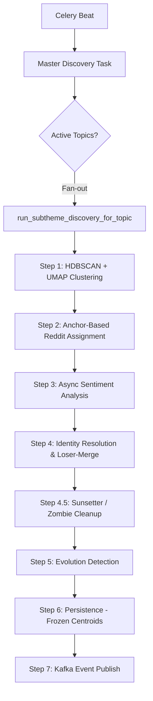

# Intelligence Layer — Low-Level Design

> **Section:** 3.8 — Sub-theme Discovery & Sentiment Analysis
> **Phase:** 3 — Low-Level Design
> **Depends on:** schema.sql, high-level-design.md, pipeline-lld.md, kafka-lld.md, celery-lld.md

---

## Table of Contents

1. [Overview](#1-overview)
2. [Data Sources](#2-data-sources)
3. [Discovery Job Orchestration](#3-discovery-job-orchestration)
4. [Step 1 — Clustering (HDBSCAN + UMAP)](#4-step-1--clustering-hdbscan--umap)
5. [Step 2 — Reddit Assignment (Anchor-Based)](#5-step-2--reddit-assignment-anchor-based)
6. [Step 3 — Async Sentiment Analysis (httpx + VADER)](#6-step-3--async-sentiment-analysis-httpx--vader)
7. [Step 4 — Identity, Relevance Gate & Labeling](#7-step-4--identity-relevance-gate--labeling)
8. [Step 4.5 — The Sunsetter (Zombie Cleanup)](#8-step-45--the-sunsetter-zombie-cleanup)
9. [Step 5 — Evolution Detection](#9-step-5--evolution-detection)
10. [Step 6 — Persistence (Frozen Centroids)](#10-step-6--persistence-frozen-centroids)
11. [Step 7 — Publish (Kafka events)](#11-step-7--publish-kafka-events)
12. [Dynamic Settings](#12-dynamic-settings)
13. [Full Flow Diagram](#13-full-flow-diagram)

---

The intelligence layer transforms a per-article alert system into a narrative intelligence system. It detects the *shape* of a topic—new narrative threads, shifting sentiments, and growing or fading themes.

It is implemented as a modular **Celery periodic task** (`run_subtheme_discovery`) that fans out to per-topic tasks. It operates on a rolling window of history, performing clustering, social signal mapping, and AI-driven labeling.

**Key Principles:**
- **Density-Based Clustering**: Uses HDBSCAN to find naturally occurring groups without specifying "K" clusters upfront.
- **Overlap-Based Identity**: A narrative keeps its identity because it keeps its articles, not because its centroid stayed put. Conflicts are resolved by global (Hungarian) assignment rather than first-come-first-served.
- **Frozen Centroids**: Never updated after creation, so they remain a permanent record of what a narrative was at birth — used as a drift veto, not as the matcher.
- **Relevance Gate**: New clusters are judged against the user's own topic description at their configured sensitivity, and off-topic ones are discarded before they reach the dashboard.
- **Cost-Controlled AI**: Only calls the LLM (Groq) for new stories or when significant volume growth triggers a relabeling requirement.
- **Async Signal Fetching**: Uses concurrent HTTP requests to pull Reddit community reactions directly for sentiment analysis.

---

## 2. Data Sources

| Source | Role | Fetch Mechanism | Used for |
|--------|------|-----------------|----------|
| **News / Articles** | Cluster Formation | Ingestion Pipeline | Defines narrative boundaries (embeddings), provides headlines. |
| **Reddit Posts** | Contextual Signal | Ingestion Pipeline | Assigned to News clusters by proximity to anchor embeddings. |
| **Reddit Comments** | Public Sentiment | Async JSON Scraper | Concurrently fetched for assigned posts to calculate VADER scores. |

---

## 3. Discovery Job Orchestration

**Trigger:** Celery Beat, interval configurable via `subtheme_discovery_interval_hours`.

**Phase 1: Fan-out**
The master task identifies all active topics and spawns a `run_subtheme_discovery_for_topic` task for each. This ensures that a crash or rate-limit on one topic does not affect others.

**Phase 2: Advisory Locking**
Uses PostgreSQL `pg_try_advisory_xact_lock` per topic. This prevents race conditions if a discovery run takes longer than the interval or if a user manually triggers a discovery run via the API.

**Phase 3: Minimum Article Guard**
Before processing, the system checks if the topic has at least `SUBTHEME_MIN_ARTICLES` (default: 5) news articles in the window. If not, it skips the topic as clustering would be statistically insignificant.

---

## 4. Step 1 — Clustering (HDBSCAN + UMAP)

**Input:** 768-dim news article embeddings for the topic window.
**Output:** Set of clusters (Sub-themes) with centroids and anchor articles.

### 4.1 UMAP Dimensionality Reduction
To improve clustering performance, high-dimensional embeddings (768d) are reduced using UMAP to `subtheme_umap_n_components` (default: 10). This preserves the global structure while making the density calculation more robust.

### 4.2 HDBSCAN Parameters
- `min_cluster_size`: Smallest grouping to be considered a theme.
- `min_samples`: Controls noise. Higher values lead to more articles being labeled as "noise" (-1).
- `cluster_selection_method`: 'eom' (Excess of Mass) for broader clusters, or 'leaf' for more specific, granular clusters.

### 4.3 Centroids and Anchors
For each cluster:
- **Centroid**: The mean vector of all member embeddings.
- **Anchors**: The top 3 articles closest to the centroid. These are used in Step 2 to ensure Reddit posts map correctly even if they are slightly off-center.
- **Representative Article**: The single article closest to the centroid.

---

## 5. Step 2 — Reddit Assignment (Anchor-Based)

**Input:** News clusters from Step 1, Reddit post embeddings.
**Output:** Reddit posts mapped to their most similar news cluster.

For each Reddit post, the system calculates the maximum similarity against the cluster's **Centroid** and its **3 Anchors**.

```python
cluster_max_sim = max(
    cosine_similarity(post_emb, centroid),
    cosine_similarity(post_emb, anchor_1),
    cosine_similarity(post_emb, anchor_2),
    cosine_similarity(post_emb, anchor_3)
)
```

If `cluster_max_sim >= subtheme_reddit_assign_threshold` (default: 0.55), the post is assigned to that cluster. This multi-point check allows social signal to map to news stories even when headlines use different vernacular (e.g., news using formal terms vs. Reddit using slang).

---

## 6. Step 3 — Async Sentiment Analysis (httpx + VADER)

**Input:** Assigned Reddit posts.
**Output:** Aggregated VADER sentiment score per sub-theme.

### 6.1 Concurrent Fetching
Instead of slow sequential PRAW calls, the system uses `httpx` and `asyncio` to fetch Reddit comment JSON directly. It uses a `Semaphore(5)` to limit concurrency and respect Reddit's platform limits.

### 6.2 Weighted Aggregation
VADER compound scores are calculated for each comment. The final sub-theme score is weighted by the comment's upvote score:
- High-upvote comments (community consensus) have more influence.
- Low-upvote/negative score comments are weighted at 1.0 to ensure they are still counted but don't drown out popular opinion.

---

## 7. Step 4 — Identity, Relevance Gate & Labeling

**Input:** Clusters with members, keywords, and sentiment.
**Output:** Resolved identities (`sub_theme_id`), off-topic clusters rejected, AI labels.

### 7.1 Identity — article overlap, not centroid similarity

Identity used to be a single nearest-centroid lookup (`LIMIT 1`) against a
centroid frozen at creation, accepted at cosine ≥ 0.85. `benchmark_identity_stability.py`
showed that cannot work (see discovery-accuracy-log.md v2): once the rolling
window turns over, the same story scores **0.790** on average against its own
frozen centroid, while genuinely different stories reach **0.803**. The
distributions overlap, so no threshold separates them — at 0.85 every benchmark
story lost its identity, was recreated as new, and had its original sunsetted to
volume 0. That is the ghost-cluster bug.

Identity now comes from the **article set shared with the previous run**, which
does separate cleanly: consecutive runs share ~92% of the window, and overlap
chains across runs so a story stays itself long after the window it was born in
has rotated away. This is only possible because `sub_theme_memberships` became
append-only with a `run_at` stamp.

```
identity_score(jaccard, cosine):
    cosine  <  subtheme_drift_floor  (0.60)  ->  0      veto — fork it
    jaccard >= subtheme_jaccard_match_threshold (0.30)  ->  1 + jaccard
    cosine  >= subtheme_centroid_match_threshold (0.85) ->  cosine
    otherwise                                          ->  0      no claim
```

Tiered rather than a weighted sum: a shared article set is direct evidence, a
similar centroid is circumstantial, so overlap always outranks cosine.

- **Cosine fallback** covers the case with no membership history (a revived
  narrative). Kept strict at 0.85, which sits above the different-story maximum
  of 0.803 and so cannot cause a false merge. It under-matches a story returning
  after a full turnover — the safe direction.
- **Drift veto** measures the current cluster against the immutable
  creation-time centroid. Below 0.60 the cluster is forked no matter how many
  articles it shares, which is what stops a chain of high-overlap runs slowly
  walking one narrative into a different one. 0.60 sits under the healthy-story
  minimum after full turnover (0.703) and over the different-story mean (0.444).

### 7.2 Conflict resolution: global assignment

Assignments are solved with the Hungarian algorithm
(`scipy.optimize.linear_sum_assignment`) over the whole score matrix.

Previously each cluster saw only its single nearest centroid, and identities were
handed out first-come-first-served. A runner-up was force-merged into the winner
even when it was a strong match for a **different, unclaimed** sub-theme it never
got to see — fusing two distinct stories. Global assignment lets a cluster take
its second choice.

The merge is retained only for clusters whose best candidate was genuinely taken
by a stronger claim, so HDBSCAN splitting one story in two still collapses back
rather than spawning a duplicate.

### 7.3 Relevance gate

Topic matching upstream is embedding similarity, which answers "is this the same
broad subject" but not "is this what the user asked for". Occasionally enough
loosely-related articles arrive together to form their own coherent cluster and
surface as a narrative nobody wanted.

The labeling call already happens for exactly the clusters at risk, so the
judgement rides along on it: the prompt carries the topic **description** (or the
Gemini expansion when the user gave none) plus a strictness rule keyed to the
topic's `sensitivity`, and the response gains a `relevant` boolean.

| sensitivity | rule |
|---|---|
| `broad` | reject only if clearly a different subject |
| `balanced` | reject if the connection is only incidental |
| `high` | keep only what is directly and substantially on-topic |

Three safety properties, all covered by `tests/test_relevance_gate.py`:

1. **Fails open.** Malformed JSON, a missing key, a null, a string, or an API
   error all resolve to *keep*. No verdict must never be read as delete.
   `temperature=0` so the same cluster is not judged differently run to run.
2. **Only new clusters can be discarded.** Established sub-themes reach this code
   too (a volume spike triggers relabeling), but rejecting one there would delete
   a narrative the user has been following, with its history, on one model call.
3. **The verdict is remembered.** A rejected cluster is stored as a bare
   `status='rejected'` marker — no memberships, no snapshot, so it can never
   reach the dashboard. Its articles stay in the window, so HDBSCAN rebuilds the
   same cluster next run; matching it against that marker drops it silently with
   **no second LLM call**, which is what keeps the verdict stable.

### 7.4 Relabeling decision
The system only calls the LLM if:
- The sub-theme is **brand new**.
- The current volume has changed significantly vs. `volume_at_last_label` (default: 50% growth).
- This prevents "label churn" where the AI rewords the same description every 6 hours despite no real change in the story.

### 7.5 Groq / Llama-3.1 labeling
Uses Groq's `llama-3.1-8b-instant` to generate a "Simple English" label (3-7 words) and a factual description. The prompt includes "People's Voices"—the top Reddit comments—to ensure the description captures the social sentiment.

---

## 8. Step 4.5 — The Sunsetter (Zombie Cleanup)

After processing the current batch, the system identifies any existing sub-themes for the topic that were **not** matched by any clusters in this run. These "zombie" themes are marked as `status = 'dormant'`. Clusters already dormant, and those rejected by the relevance gate, are skipped so they do not keep emitting a zero snapshot every run. This allows the UI to hide fading stories while preserving their history in the snapshots table.

---

## 9. Step 5 — Evolution Detection

Two pure functions in `app/tasks/discovery/evolution.py`, deliberately separate.
Status describes where a cluster **is**; events describe a **transition** worth
notifying about. Deriving one from the other is what previously allowed a
cluster to publish `growing` and `disappearing` in the same run.

### 9.1 Status — `classify_status(prev_volume, volume)`

Reads the previous snapshot's `total_volume` and this run's volume (news members
after the similarity guard, plus Reddit posts). Nothing else.

| Condition | Status | `growth_pct` |
|---|---|---|
| `volume == 0` | `dormant` | `-1.0`, or `NULL` with no real baseline |
| no previous snapshot | `new` | `NULL` |
| `prev_volume == 0`, `volume > 0` | `revival` | `NULL` — undefined against a zero base |
| `delta >= subtheme_growing_threshold` | `growing` | the delta |
| `delta <= -subtheme_declining_threshold` | `declining` | the delta |
| otherwise | `steady` | the delta |

`rejected` is reserved for the LLM relevance gate and is never produced here.

`growth_pct` is deliberately `NULL` rather than a number wherever no baseline
exists — the old code passed a raw article count through a percentage formatter
and rendered a revived 7-article cluster as "+700%".

Decay relative to the all-time **peak** no longer affects status. It is a
different yardstick from the run-over-run delta, and mixing the two meant a live
cluster holding 15 articles that once peaked at 100 was ruled inactive and
disappeared from the dashboard.

### 9.2 Events — `derive_events(prev_status, status)`

Fires on the edge, not the level, so a story that keeps growing alerts once
rather than on every run.

| Transition | Event |
|---|---|
| first sighting (non-dormant) | `sub_theme_emerging` |
| `* → revival` | `sub_theme_emerging` |
| `* → growing` | `sub_theme_growing` |
| `* → dormant` | `sub_theme_disappearing` |
| status unchanged | none |

`sub_theme_sentiment_shift` is evaluated independently of volume — a story can
hold a flat volume while the mood around it turns — and never influences status.

Covered by `tests/test_evolution_state_machine.py`.

---

## 10. Step 6 — Persistence (Frozen Centroids)

### 10.1 Frozen Centroids
Once a sub-theme is created, its **Centroid is frozen**. Subsequent updates refresh keywords, representative articles, and status, but do NOT update the embedding vector. 
- **Why?** Updating the centroid causes "semantic drift," where a sub-theme about "NVIDIA H200 chips" slowly drifts into "AI GPU cooling" as new articles arrive, eventually losing its original meaning. Freezing ensures the identity remains anchored.

### 10.2 Similarity Guard
During persistence, any news article member whose similarity to the centroid is `< 0.60` is kicked out. This acts as a final sanity check against HDBSCAN's density-based grouping errors.

---

## 11. Step 7 — Publish (Kafka events)

Events detected in Step 5 are published to the `sub-theme-events` Kafka topic. The message includes:
- `event_type`, `sub_theme_id`, `sub_theme_snapshot_id`, `topic_id`, `user_id`.

The Alert Service consumes this to push WebSocket notifications or email digests.

---

## 12. Dynamic Settings

The pipeline avoids hardcoded magic numbers by seeding and reading from the `system_settings` table.

| Variable | Default | Role |
|----------|---------|------|
| `subtheme_window_days` | 3 | Historical window for articles. |
| `subtheme_min_articles` | 5 | Minimum news count to run discovery. |
| `subtheme_min_cluster_size`| 3 | Smallest cluster size for HDBSCAN. |
| `subtheme_centroid_match_threshold` | 0.85 | Similarity needed to match existing ID. |
| `subtheme_relabel_volume_change_threshold`| 0.50 | Growth needed to trigger LLM relabeling. |
| `subtheme_growing_threshold` | 0.50 | Growth needed to fire 'growing' alert. |

---

## 13. Full Flow Diagram


```mermaid
graph TD
    A[Celery Beat] --> B[Master Discovery Task]
    B --> C{Active Topics?}
    C -->|Fan-out| D[run_subtheme_discovery_for_topic]
    D --> E[Step 1: HDBSCAN + UMAP Clustering]
    E --> F[Step 2: Anchor-Based Reddit Assignment]
    F --> G[Step 3: Async Sentiment Analysis]
    G --> H[Step 4: Identity Resolution & Loser-Merge]
    H --> I[Step 4.5: Sunsetter / Zombie Cleanup]
    I --> J[Step 5: Evolution Detection]
    J --> K[Step 6: Persistence - Frozen Centroids]
    K --> L[Step 7: Kafka Event Publish]
```

---

> This document is part of Phase 3 (Low-Level Design).
> Updated: 2026-04-28
